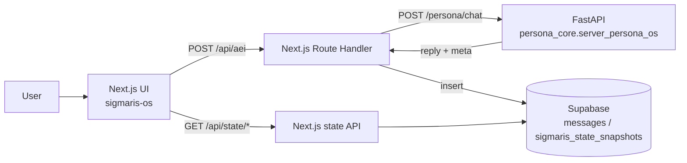

**Languages:** [English](README.md) | 日本語

# Project Sigmaris - Persona OS / LLM Control Plane

Sigmaris は、長期稼働するAI（常駐型のパーソナルAIや業務エージェント）を前提にした **LLM外部制御レイヤ（Control Plane）** のプロトタイプです。

LLMの「応答の賢さ」そのものではなく、次のような **運用上の必須要件** をモデルの外側で扱います。

- セッションをまたぐ同一性（Identity continuity）
- 記憶の取捨選択と再注入（Memory orchestration）
- 価値/特性のドリフト監視（Value/Trait drift）
- 状態機械による挙動統制（Global state machine）
- Safety gating（簡易）
- 追跡可能性（trace_id と meta の記録・可視化）

このリポジトリに含まれるもの:

- **Backend (Python/FastAPI)**: `POST /persona/chat` が `reply` と `meta`（内面状態）を返す
- **Frontend (Next.js + Supabase Auth)**: Googleログイン -> チャット -> **状態ダッシュボード**（`/status`）
- **Supabase 永続化**: チャットログと状態スナップショットを時系列で保存し、グラフ化する

---

## デモで一番刺さるポイント

「返答が賢い」よりも、次が一番伝わります。

> 1ターンごとに内部状態（meta）を数値として返し、保存し、時系列で可視化できる  
> -> 状態を外部から制御できる（安全・安定・ドリフト）

これが "OS" 的に見せられる部分です。

---

## Architecture (high level)



---

## Repository layout

- `sigmaris_core/` - Persona OS backend（memory / identity / drift / state machine / trace）
- `sigmaris-os/` - Next.js frontend（Supabase Auth, chat UI, `/status` dashboard）
- `sigmaris-os/supabase/FRONTEND_SCHEMA.sql` - フロントで使うSupabaseテーブル定義
- `sigmaris_core/persona_core/storage/SUPABASE_SCHEMA.sql` - backend側の永続化を深く作る場合のテーブル定義（任意）

---

## Quickstart (local)

### 1) Backend (FastAPI)

1. `.env.example` -> `.env` にコピーして `OPENAI_API_KEY` を設定
2. 起動:

```bash
python -m uvicorn persona_core.server_persona_os:app --reload --port 8000
```

- Swagger: `http://127.0.0.1:8000/docs`
- Minimal request:

```bash
curl -X POST "http://127.0.0.1:8000/persona/chat" \
  -H "Content-Type: application/json" \
  -d '{"user_id":"u_test_001","session_id":"s_test_001","message":"Hello. Describe your role in one sentence."}'
```

### 2) Frontend (Next.js)

1. `sigmaris-os/.env.example` -> `sigmaris-os/.env.local` にコピーしてSupabaseの値を設定
2. 起動:

```bash
cd sigmaris-os
npm install
npm run dev
```

- App: `http://localhost:3000`
- Dashboard: `http://localhost:3000/status`

---

## Supabase setup

Supabase の SQL Editor で実行:

- `sigmaris-os/supabase/FRONTEND_SCHEMA.sql`

`/status` が `PGRST205`（schema cache）で落ちる場合、テーブル作成後に PostgREST のスキーマ再読み込みが必要なことがあります。

---

## Security notes

- `.env` / `.env.local` は絶対にコミットしない（`.gitignore` 済み）
- `SUPABASE_SERVICE_ROLE_KEY` は強権限なので server-side のみで扱う
- 誤ってpushした可能性があるなら、OpenAI/Supabaseのキーはローテーションする

---

## Key endpoints

- Backend: `POST /persona/chat` -> `{ reply, meta }`
- Frontend proxy: `POST /api/aei` -> backend呼び出し + `messages` / `sigmaris_state_snapshots` に保存
- Dashboard APIs: `GET /api/state/latest`, `GET /api/state/timeseries?limit=60`
