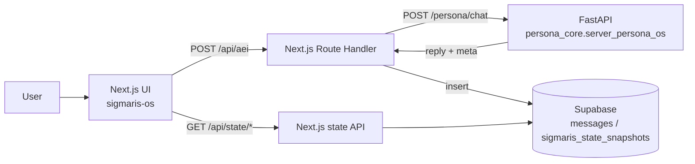

**Languages:** English | [日本語](README.ja.md)

# Project Sigmaris - Persona OS / LLM Control Plane

Sigmaris is a working prototype of a **control plane for long-running LLM personas**.
Instead of relying on “whatever the model does inside a chat session”, Sigmaris keeps key parts **outside the model** as a system:

- Identity continuity across sessions
- Memory selection + reinjection (memory orchestration)
- Value / trait drift tracking
- Global state machine (NORMAL / OVERLOADED / SAFETY_LOCK / etc.)
- Safety gating (simple)
- Traceability (trace_id + auditable `meta`)

This repository includes:

- **Backend (Python / FastAPI)**: `POST /persona/chat` returns `reply` + `meta` (internal state)
- **Frontend (Next.js + Supabase Auth)**: Google login -> chat -> **state dashboard** (`/status`)
- **Supabase persistence**: stores chat messages + state snapshots for timeseries graphs

---

## What to demo (the “OS” part)

The strongest demo is not “the reply is smart”, but:

> You can return internal state (`meta`) as numbers per turn, store it, and visualize it over time  
> -> use state as an external control surface (safety, stability, drift).

---

## Architecture (high level)



---

## Repository layout

- `sigmaris_core/` - Persona OS backend (memory / identity / drift / state machine / trace)
- `sigmaris-os/` - Next.js frontend (Supabase Auth, chat UI, `/status` dashboard)
- `sigmaris-os/supabase/FRONTEND_SCHEMA.sql` - Supabase tables required by the frontend
- `sigmaris_core/persona_core/storage/SUPABASE_SCHEMA.sql` - optional tables for deeper backend-side persistence

---

## Quickstart (local)

### 1) Backend (FastAPI)

1. Copy `.env.example` -> `.env` and set `OPENAI_API_KEY`
2. Run:

```bash
python -m uvicorn persona_core.server_persona_os:app --reload --port 8000
```

- Swagger UI: `http://127.0.0.1:8000/docs`
- Minimal request:

```bash
curl -X POST "http://127.0.0.1:8000/persona/chat" \
  -H "Content-Type: application/json" \
  -d '{"user_id":"u_test_001","session_id":"s_test_001","message":"Hello. Describe your role in one sentence."}'
```

### 2) Frontend (Next.js)

1. Copy `sigmaris-os/.env.example` -> `sigmaris-os/.env.local` and set your Supabase values
2. Run:

```bash
cd sigmaris-os
npm install
npm run dev
```

- App: `http://localhost:3000`
- Dashboard: `http://localhost:3000/status`

---

## Supabase setup

Run this in the Supabase SQL Editor:

- `sigmaris-os/supabase/FRONTEND_SCHEMA.sql`

If `/status` fails with `PGRST205` (schema cache), you may need to refresh PostgREST schema after creating tables.

---

## Security notes

- Never commit `.env` / `.env.local` (this repo ignores them via `.gitignore`)
- `SUPABASE_SERVICE_ROLE_KEY` is highly privileged; keep it server-side only
- If you ever pushed secrets by mistake, rotate keys immediately

---

## Key endpoints

- Backend: `POST /persona/chat` -> `{ reply, meta }`
- Frontend proxy: `POST /api/aei` -> calls backend and stores `messages` / `sigmaris_state_snapshots`
- Dashboard APIs: `GET /api/state/latest`, `GET /api/state/timeseries?limit=60`
